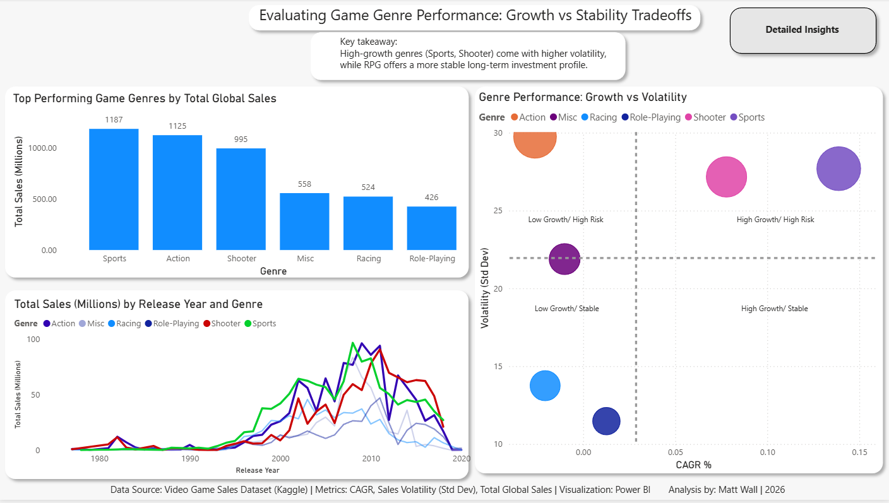
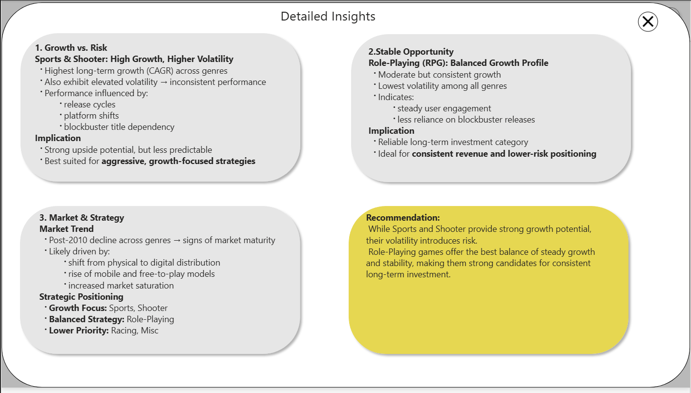

# video-game-genre-analysis-powerbi
Power BI analysis of video game genre performance using CAGR and volatility to evaluate growth vs stability tradeoffs and inform long-term investment strategy.

## 🎯 Objective

To evaluate which video game genres offer the best balance of growth and stability for long-term investment decisions.

## 🧠 Key Insights

- Sports & Shooter: High growth but high volatility (higher risk)
- Role-Playing (RPG): Balanced growth with lowest volatility
- Racing & Misc: Lower growth and limited strategic value
- Post-2010 trends suggest market maturity and platform shifts

- ## 📈 Recommendation

Role-Playing games provide the best balance of steady growth and stability, while Sports and Shooter offer higher upside with increased risk.

## 📊 Dashboard Preview

## 🛠 Tools Used

- Power BI
- DAX (CAGR, Volatility)
- Data analysis and visualization

## 📁 Data Source

Video Game Sales Dataset (Kaggle)
